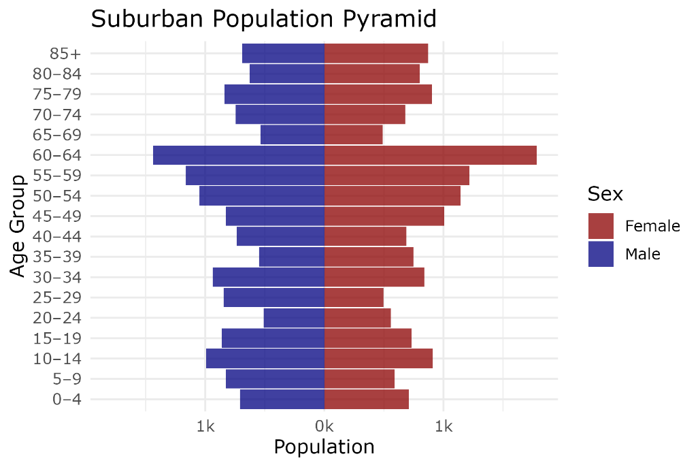
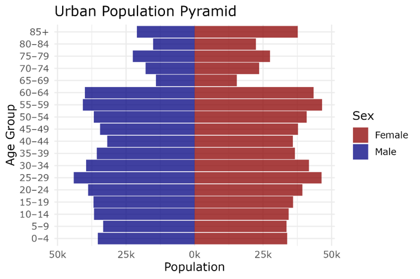
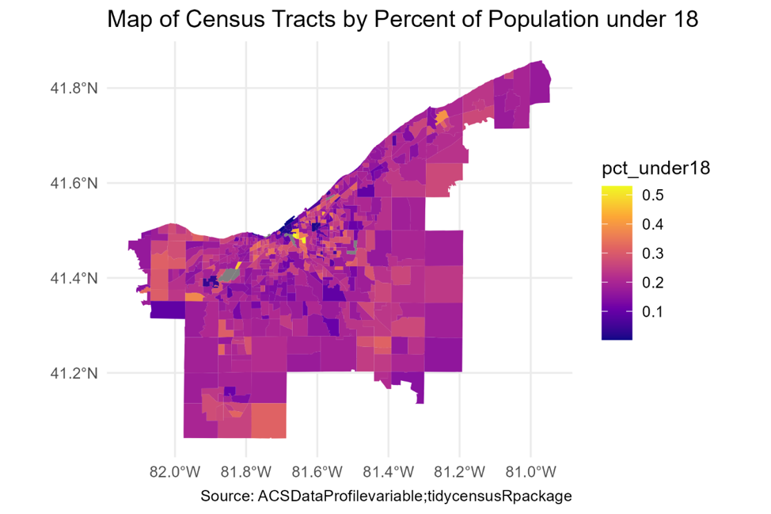
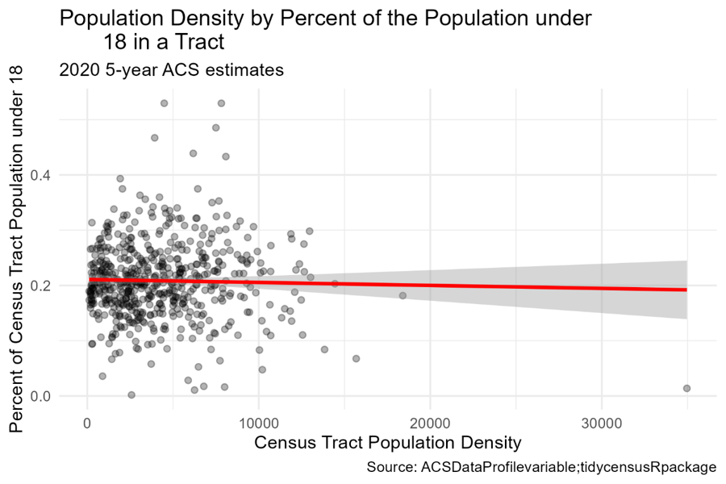
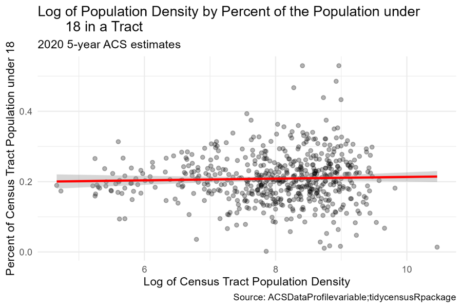
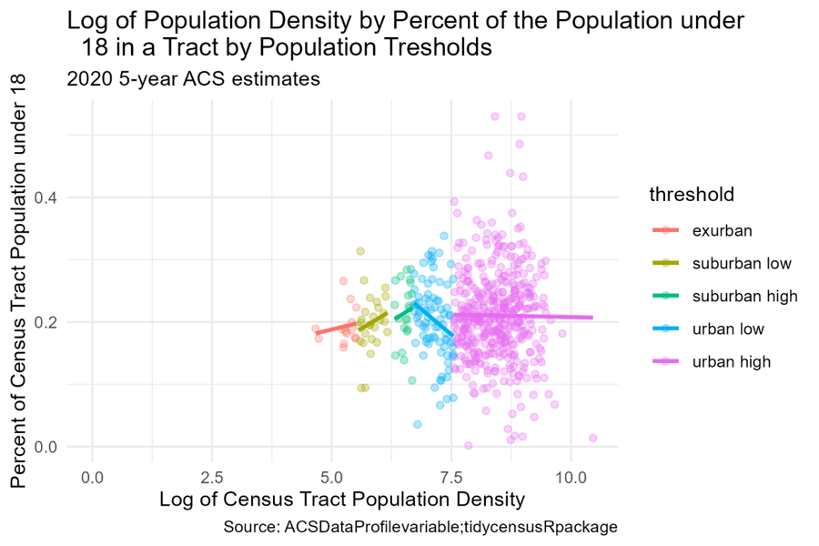
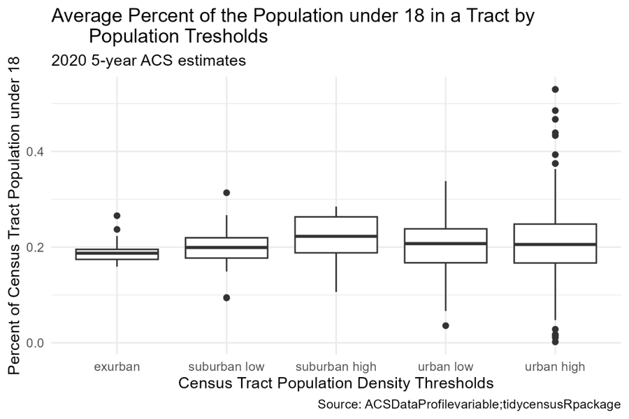
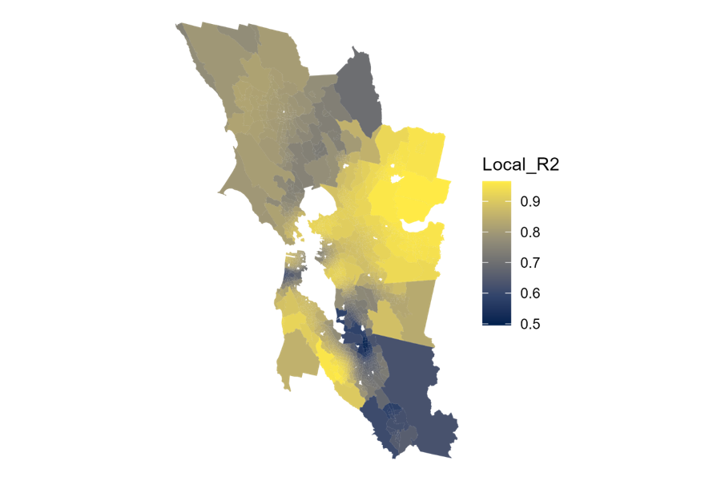
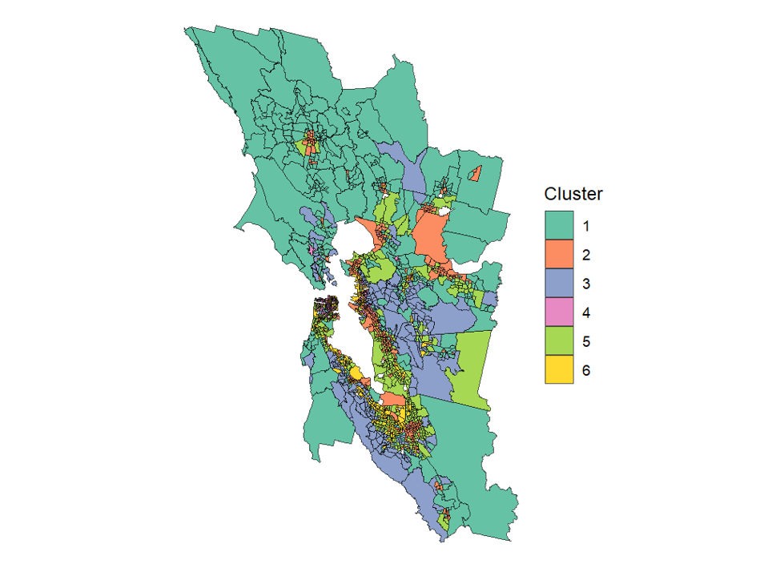

## Replication Study

I chose to examine the Greater Cleveland metropolitan area. The metropolitan area has a population of about 2.2 million people, as of the 2020 census. Cleveland, the largest city within the metro at about 370,000 people, anchors the region on the south shore of Lake Erie, while the rest of the metro radiates outward. As a whole, the region has a median income of about \$46,000 with about 15% of people living below the poverty line. Demographically, the area is approximately 71% White, 20% Black, 5% Hispanic/Latino, 2% broadly Asian, with the remaining comprised of two or more races, Native Americans and Alaskan Natives. Gender differences are almost evenly split, with about 52% of the population identifying as female and 48% as male.

Figure 1 shows the spatial distribution of population density follows a pattern radiating out from Cleveland. Generally, the thresholds move from most dense to least dense the farther away they are from the central city. This creates a concentric ring effect where lower-density rings surround higher ones, a pattern seen throughout the country resulting from suburbanization. That said, with the thresholds structured as they are, the graph loses deeper nuance that might show subtler differences between the thresholds.

Figure 1Map of Population Thresholds

Figures 2 and 3 compare the populations between the suburban and urban thresholds by male and female genders.

Figure 2 shows the suburban distribution having relatively equal younger (under 24) and older (over 65) people. However, there is a trend, starting at about 40 years old of increasing people until 65, when it drops off steeply. This could indicate a relocation out of the suburbs, fitting existing cultural norms of retirement in warm weather. Figure 3, shows the urban distribution having roughly equal populations, with bulges in the 25 to 29 range and 55 to 64 range. After 64, there is a marked drop off in people 65 years old and over.

Figure 2: Suburban Population Pyramid

Figure 3: Urban Population Pyramid

Figure 4: Map of Population Under 18 shows the proportion of Census tracts population that is under 18, across the metropolitan area. This indicates there are some rough spatial patterns, with a ring of higher percent around the core city, followed by a ring of lower percent, and then another higher one.

Figure 4: Map of Population Under 18

To test the relationship between tract density and proportion of children, I ran three regressions. Figures 5, 6, and 7 show regressions of the relationship between a tract’s density and its percent of the population under 18 years old. \

Figure 5 depicts Model 1, a simple linear regression that indicates a slight negative relationship with extreme variation in the percent of under 18-year-olds in tracts of comparable density. Figure 6 provides a regression with a log of the density variable to build Model 2 and indicates a slight positive relationship, again with extreme amounts of variation. Finally, Figure 7 constructed Model 3 by separating the densities by thresholds and shows slight positive relationships for the non-urban spaces and negative ones for the urban ones.

Figure 5: Density and Population under 18

Figure 6: Log Density and Population Under 18

Figure 7: Log Density and Population Under 18 by Threshold

Table 1 provides tests of significance for the three models. Although there appears to be some level of association between the variables used in Figure 5, 6, and 7, the model summary table indicates that none were significant at any level. This is likely due to the large amount of variation of the percent of children within each tract at similar densities. What we can learn from this is that density of the urban environment is not a strong predictor for the population breakdown with regard to the number of children.

Table 1: Model Summaries

+-------+----------------------------------------------------------------+------+------------+------+------------+------+--------+------+
|       |                                                                |      |            |      |            |      |        |      |
+-------+----------------------------------------------------------------+------+------------+------+------------+------+--------+------+
|       |                                                                |      | model1     |      | model2     |      | model3 |      |
+-------+----------------------------------------------------------------+------+------------+------+------------+------+--------+------+
|       |                                                                |      |            |      |            |      |        |      |
+-------+----------------------------------------------------------------+------+------------+------+------------+------+--------+------+
|       | Intercept                                                      |      | 0.21\*\*\* |      | 0.19\*\*\* |      | 0.10   |      |
+-------+----------------------------------------------------------------+------+------------+------+------------+------+--------+------+
|       |                                                                |      |            |      |            |      |        |      |
+-------+----------------------------------------------------------------+------+------------+------+------------+------+--------+------+
|       |                                                                |      | (0.00)     |      | (0.02)     |      | (0.39) |      |
+-------+----------------------------------------------------------------+------+------------+------+------------+------+--------+------+
|       |                                                                |      |            |      |            |      |        |      |
+-------+----------------------------------------------------------------+------+------------+------+------------+------+--------+------+
|       | Tract Density                                                  |      | -0.00      |      |            |      |        |      |
+-------+----------------------------------------------------------------+------+------------+------+------------+------+--------+------+
|       |                                                                |      |            |      |            |      |        |      |
+-------+----------------------------------------------------------------+------+------------+------+------------+------+--------+------+
|       |                                                                |      | (0.00)     |      |            |      |        |      |
+-------+----------------------------------------------------------------+------+------------+------+------------+------+--------+------+
|       |                                                                |      |            |      |            |      |        |      |
+-------+----------------------------------------------------------------+------+------------+------+------------+------+--------+------+
|       | Log Density                                                    |      |            |      | 0.00       |      | 0.02   |      |
+-------+----------------------------------------------------------------+------+------------+------+------------+------+--------+------+
|       |                                                                |      |            |      |            |      |        |      |
+-------+----------------------------------------------------------------+------+------------+------+------------+------+--------+------+
|       |                                                                |      |            |      | (0.00)     |      | (0.07) |      |
+-------+----------------------------------------------------------------+------+------------+------+------------+------+--------+------+
|       |                                                                |      |            |      |            |      |        |      |
+-------+----------------------------------------------------------------+------+------------+------+------------+------+--------+------+
|       | Suburban (Low)                                                 |      |            |      |            |      | -0.17  |      |
+-------+----------------------------------------------------------------+------+------------+------+------------+------+--------+------+
|       |                                                                |      |            |      |            |      |        |      |
+-------+----------------------------------------------------------------+------+------------+------+------------+------+--------+------+
|       |                                                                |      |            |      |            |      | (0.57) |      |
+-------+----------------------------------------------------------------+------+------------+------+------------+------+--------+------+
|       |                                                                |      |            |      |            |      |        |      |
+-------+----------------------------------------------------------------+------+------------+------+------------+------+--------+------+
|       | Suburban (High)                                                |      |            |      |            |      | -0.20  |      |
+-------+----------------------------------------------------------------+------+------------+------+------------+------+--------+------+
|       |                                                                |      |            |      |            |      |        |      |
+-------+----------------------------------------------------------------+------+------------+------+------------+------+--------+------+
|       |                                                                |      |            |      |            |      | (0.96) |      |
+-------+----------------------------------------------------------------+------+------------+------+------------+------+--------+------+
|       |                                                                |      |            |      |            |      |        |      |
+-------+----------------------------------------------------------------+------+------------+------+------------+------+--------+------+
|       | Urban (Low)                                                    |      |            |      |            |      | 0.57   |      |
+-------+----------------------------------------------------------------+------+------------+------+------------+------+--------+------+
|       |                                                                |      |            |      |            |      |        |      |
+-------+----------------------------------------------------------------+------+------------+------+------------+------+--------+------+
|       |                                                                |      |            |      |            |      | (0.45) |      |
+-------+----------------------------------------------------------------+------+------------+------+------------+------+--------+------+
|       |                                                                |      |            |      |            |      |        |      |
+-------+----------------------------------------------------------------+------+------------+------+------------+------+--------+------+
|       | Urban (High)                                                   |      |            |      |            |      | 0.13   |      |
+-------+----------------------------------------------------------------+------+------------+------+------------+------+--------+------+
|       |                                                                |      |            |      |            |      |        |      |
+-------+----------------------------------------------------------------+------+------------+------+------------+------+--------+------+
|       |                                                                |      |            |      |            |      | (0.39) |      |
+-------+----------------------------------------------------------------+------+------------+------+------------+------+--------+------+
|       |                                                                |      |            |      |            |      |        |      |
+-------+----------------------------------------------------------------+------+------------+------+------------+------+--------+------+
|       | Log Density × Suburban (Low)                                   |      |            |      |            |      | 0.03   |      |
+-------+----------------------------------------------------------------+------+------------+------+------------+------+--------+------+
|       |                                                                |      |            |      |            |      |        |      |
+-------+----------------------------------------------------------------+------+------------+------+------------+------+--------+------+
|       |                                                                |      |            |      |            |      | (0.10) |      |
+-------+----------------------------------------------------------------+------+------------+------+------------+------+--------+------+
|       |                                                                |      |            |      |            |      |        |      |
+-------+----------------------------------------------------------------+------+------------+------+------------+------+--------+------+
|       | Log Density × Suburban (High)                                  |      |            |      |            |      | 0.03   |      |
+-------+----------------------------------------------------------------+------+------------+------+------------+------+--------+------+
|       |                                                                |      |            |      |            |      |        |      |
+-------+----------------------------------------------------------------+------+------------+------+------------+------+--------+------+
|       |                                                                |      |            |      |            |      | (0.15) |      |
+-------+----------------------------------------------------------------+------+------------+------+------------+------+--------+------+
|       |                                                                |      |            |      |            |      |        |      |
+-------+----------------------------------------------------------------+------+------------+------+------------+------+--------+------+
|       | Log Density × Urban (Low)                                      |      |            |      |            |      | -0.08  |      |
+-------+----------------------------------------------------------------+------+------------+------+------------+------+--------+------+
|       |                                                                |      |            |      |            |      |        |      |
+-------+----------------------------------------------------------------+------+------------+------+------------+------+--------+------+
|       |                                                                |      |            |      |            |      | (0.08) |      |
+-------+----------------------------------------------------------------+------+------------+------+------------+------+--------+------+
|       |                                                                |      |            |      |            |      |        |      |
+-------+----------------------------------------------------------------+------+------------+------+------------+------+--------+------+
|       | Log Density × Urban (High)                                     |      |            |      |            |      | -0.02  |      |
+-------+----------------------------------------------------------------+------+------------+------+------------+------+--------+------+
|       |                                                                |      |            |      |            |      |        |      |
+-------+----------------------------------------------------------------+------+------------+------+------------+------+--------+------+
|       |                                                                |      |            |      |            |      | (0.07) |      |
+-------+----------------------------------------------------------------+------+------------+------+------------+------+--------+------+
|       |                                                                |      |            |      |            |      |        |      |
+-------+----------------------------------------------------------------+------+------------+------+------------+------+--------+------+
|       | Num.Obs.                                                       |      | 574        |      | 574        |      | 574    |      |
+-------+----------------------------------------------------------------+------+------------+------+------------+------+--------+------+
|       |                                                                |      |            |      |            |      |        |      |
+-------+----------------------------------------------------------------+------+------------+------+------------+------+--------+------+
|       | R2                                                             |      | 0.001      |      | 0.001      |      | 0.012  |      |
+-------+----------------------------------------------------------------+------+------------+------+------------+------+--------+------+
|       |                                                                |      |            |      |            |      |        |      |
+-------+----------------------------------------------------------------+------+------------+------+------------+------+--------+------+
|       | \+ p \< 0.1, \* p \< 0.05, \*\* p \< 0.01, \*\*\* p \< 0.001   |      |            |      |            |      |        |      |
+-------+----------------------------------------------------------------+------+------------+------+------------+------+--------+------+
|       |                                                                |      |            |      |            |      |        |      |
+-------+----------------------------------------------------------------+------+------------+------+------------+------+--------+------+

Figure 6 compares the thresholds against the average density and presents the a similar conclusion to Table 1. There is significant variation in the proportion of a tracts population that is under 18. Although this is particularly true in the urban high category, each category experiences high variation.

Table 2: Average Population under 18 and Threshold

<https://github.com/match214/Replication_Study.git>

## Spatial Regression

For a lab, I had to perform two regressions for an MSA. I chose to analyze median housing value in the San Francisco Bay Area.

Figure 1 creates a geographically weighted regression model for explaining median housing value. The model for explaining median housing value is not uniformly distributed across the nine-county region of the San Francisco Bay. For the most part, the model either does well or poorly. It appears to do quite well in the far East Bay (Contra Costa County) and the Peninsula (San Mateo County). It does poorly in the South Bay (Santa Clara County). The results are mixed in the North Bay (Marin, Napa, Solano, and Sonoma Counties) as well as in the City and County San Francisco. This could be a result of the substantial geographic variation in housing markets forcing the model to explain too much.

Figure 1: Geographically Weighted Regression

In Figure 2, the clusters reveal how similar tracts may be across the geographies of the nine-counties. The clusters aggregate spaces with similar effects of the variables on the median housing value. Many of the peripheral areas are rural and sparsely populated and fall under cluster 1. These areas tend to cohere around clusters 2 and 3, with occasional interruptions of cluster 5. Clusters 4 and 6 are more isolated from others, existing in the most parts of the densest cities, San Francisco and San José.

Figure 2: K-Means Cluster

